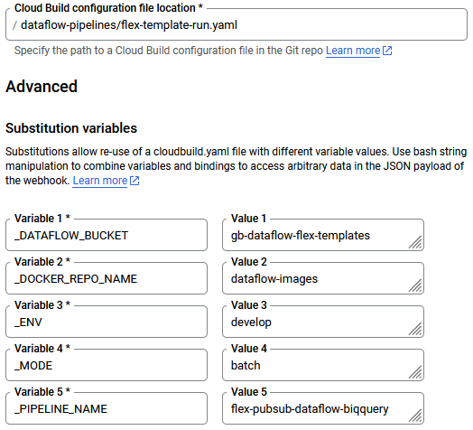

# JIRA tickets
To setup Dataflow pipelines using custom Python package along with a Cloud Build CI/CD, here is the list of tasks to be performed. If you do not want to use a custom Python package from Artifact Registry, simply ignore de [PYTHON PACKAGE] steps.

We assume that each environment has its own dedicated GCP project.

In `develop` GCP project:
1. Enable APIs: Artifact Registry API, Cloud Build API, Dataflow API, and Secret Manager API
2. Create Artifact Registry Docker repository in a specific region, for example `europe-west1`
3. [PYTHON PACKAGE] Create Artifact Registry Python repository in this same region
4. Create Cloud Build service account `sa-cloud-build` with following roles:
    - Artifact Registry Writer
    - Cloud Build Editor
    - Logs Writer
    - Service Account User of the default Compute Engine service account of the project (Dataflow uses it)
    - Storage Object User
    - Dataflow Developer
5. It is recommended to [replace the worker service account with a user-managed service account](https://cloud.google.com/dataflow/docs/concepts/security-and-permissions#permissions)
6. Create Cloud Storage bucket for Dataflow templates and artifacts
7. Create a GitHub host connection and connect it to your Dataflow GitHub repository (could also be GitLab or something else)
8. [PYTHON PACKAGE] Create Cloud Build 2nd gen trigger with `push to main branch` event linked to the [custom Python package GitHub repository](https://github.com/gregoireborel/gborelpy) (keep default configuration with `cloudbuild.yaml`). Attach `sa-cloud-build` to the trigger
9. Create Cloud Build 2nd gen trigger with `push to feature/ branch` event linked to Dataflow GitHub repository.  Attach `sa-cloud-build` to the trigger. Apply following configuration:

9. Create Cloud Build 2nd gen trigger with `manual invocation` response linked to Dataflow GitHub repository.  Attach `sa-cloud-build` to the trigger. Apply following configuration:

In `staging` GCP project:
1. Enable APIs: Artifact Registry API, Cloud Build API, Dataflow API, and Secret Manager API
2. Create Artifact Registry Docker repository
3. Create Cloud Build service account `sa-cloud-build` with following roles:
    - Artifact Registry Writer
    - Cloud Build Editor
    - Logs Writer
    - Service Account User of the default Compute Engine service account of the project (Dataflow uses it)
    - Storage Object User
    - Dataflow Developer
4. It is recommended to [replace the worker service account with a user-managed service account](https://cloud.google.com/dataflow/docs/concepts/security-and-permissions#permissions)
5. Create Cloud Storage bucket for Dataflow templates and artifacts
6. Create Cloud Build 2nd gen trigger with `push to main branch` event linked to Dataflow GitHub repository. Attach `sa-cloud-build` to the trigger. Apply following configuration:

7. Create Cloud Build 2nd gen trigger with `manual invocation` response linked to Dataflow GitHub repository. Attach `sa-cloud-build` to the trigger. Apply following configuration:

