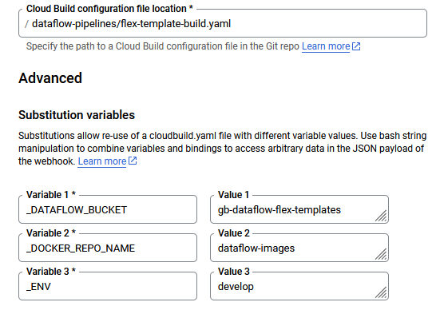
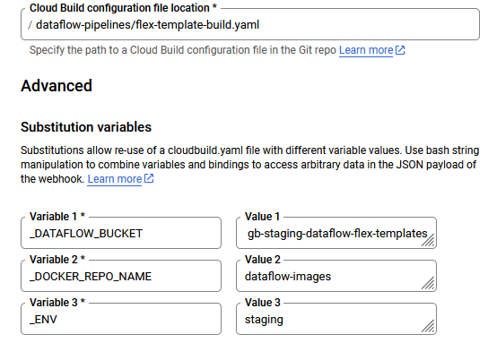

# JIRA tickets
To setup Dataflow pipelines using custom Python package along with a Cloud Build CI/CD, here is the list of tasks to be performed:

We assume that each environment has its own dedicated GCP project.

In `develop` GCP project:
1. Enable APIs for: Artifact Registry, Cloud Build, Dataflow
2. Create Artifact Registry Docker repository
3. Create Artifact Registry Python repository
4. Create Cloud Build Service Account `sa-cloud-build` with following roles:
    - Artifact Registry Writer
    - Cloud Build Editor
    - Dataflow Admin
    - Storage Object Admin
    - Service Usage Consumer
    - Service Account User of the default Compute Engine Service Account of the project (Dataflow uses it)
5. Create Cloud Storage bucket for Dataflow templates and artifacts
6. Create Cloud Build 2nd gen trigger with `push to main branch` event linked to Python package GitHub repository (keep default configuraiton with `cloudbuild.yaml`). Attach `sa-cloud-build` to the trigger
7. Create Cloud Build 2nd gen trigger with `push to feature/ branch` event linked to Dataflow GitHub repository.  Attach `sa-cloud-build` to the trigger. Apply following configuration:

8. Create Cloud Build 2nd gen trigger with `manual invocation` response linked to Dataflow GitHub repository.  Attach `sa-cloud-build` to the trigger. Apply following configuration:

In `staging` GCP project:
1. Enable APIs for: Artifact Registry, Cloud Build, Dataflow
2. Create Artifact Registry Docker repository
3. Create Cloud Build Service Account `sa-cloud-build` with following roles:
    - Artifact Registry Writer
    - Cloud Build Editor
    - Dataflow Admin
    - Storage Object Admin
    - Service Usage Consumer
    - Service Account User of the default Compute Engine Service Account of the project (Dataflow uses it)
4. Grant access to the `sa-cloud-build` in `develop` project with the Artifact Registry Reader role (in order to get access to Artifact Registry)
5. Create Cloud Storage bucket for Dataflow templates and artifacts
6. Create Cloud Build 2nd gen trigger with `push to main branch` event linked to Dataflow GitHub repository.  Attach `sa-cloud-build` to the trigger. Apply following configuration:

7. Create Cloud Build 2nd gen trigger with `manual invocation` response linked to Dataflow GitHub repository.  Attach `sa-cloud-build` to the trigger. Apply following configuration:

